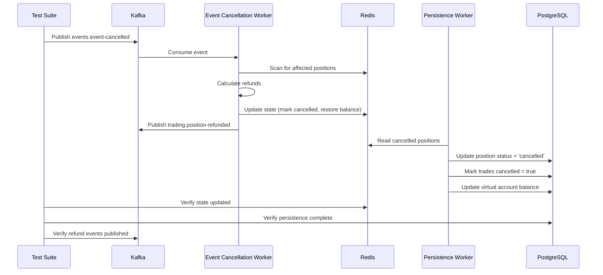

# Event Cancellation Tests Documentation

## Overview

Comprehensive test suite for the event cancellation system, covering refund calculations, Redis state updates, Kafka event flows, and database persistence.

## Test Files

### Unit Tests: `backend/tests/unit/event-cancellation.test.ts`

Tests the refund calculation logic in isolation using pure functions.

**Test Coverage:**
- Basic refund calculation for crypto positions
- Basic refund calculation for prediction market positions
- Multiple positions on same event
- Edge cases (zero quantity, large quantities, small/large prices)
- Different fee structures (crypto vs prediction markets)
- Verification that refunds are cost recovery only (no profit/loss)

**Running Unit Tests:**
```bash
cd backend/core-service
bun test ../tests/unit/event-cancellation.test.ts
```

### Integration Tests: `backend/tests/integration/event-cancellation.test.ts`

Tests the complete end-to-end flow from Kafka event consumption through database persistence.

**Test Coverage:**
- Complete event cancellation flow for single position
- Multiple positions on same event
- Mixed events - only affected positions cancelled
- Cancelled trades don't count toward minimum trade requirements
- Correlation ID propagation through event flow
- Persistence retry and error handling
- Idempotency - duplicate event cancellation

**Running Integration Tests:**
```bash
cd backend/core-service
bun test ../tests/integration/event-cancellation.test.ts
```

**Prerequisites for Integration Tests:**
```bash
# Start test environment
docker-compose -f docker-compose.test.yml up -d

# Verify services are running
curl http://localhost:3000/health
```

## Test Scenarios

### Unit Test Scenarios

#### 1. Basic Refund Calculation for Crypto Positions
- **Input:** Position with entryPrice=50000, quantity=1, fee=0.1%
- **Expected:** Refund = 50050 (cost + fee, no profit/loss)
- **Verification:** Refund exactly equals cost recovery

#### 2. Basic Refund Calculation for Prediction Markets
- **Input:** Position with entryPrice=0.6, quantity=100, fee=0.05%
- **Expected:** Refund = 60.03 (cost + fee)
- **Verification:** Refund calculated correctly for different probabilities (0.4, 0.6, 0.8)

#### 3. Multiple Positions on Same Event
- **Input:** 3 positions with different entry prices (0.4, 0.6, 0.8)
- **Expected:** Total refund = sum of individual refunds
- **Verification:** Total refund = 180.09

#### 4. Edge Cases
- **Zero quantity:** Refund = 0
- **Large quantity (1000):** Refund = 50,050,000 (precision maintained)
- **Small entry price (0.01):** Refund = 10.005
- **Large entry price (100000):** Refund = 100,100

#### 5. Different Fee Structures
- **Crypto fee (0.1%):** Applied correctly
- **Prediction market fee (0.05%):** Applied correctly
- **Higher fee (0.2%):** Applied correctly

#### 6. No Profit/Loss in Refund
- **Profitable position:** Refund based on entry price, not current price
- **Losing position:** Refund based on entry price, not current price
- **Verification:** Refund never includes unrealized P&L

### Integration Test Scenarios

#### 1. Complete Event Cancellation Flow
**Flow:**
1. Create assessment with active position in Redis
2. Publish `events.event-cancelled` Kafka message
3. Event cancellation worker processes event
4. Redis state updated: position marked 'cancelled', balance restored
5. `trading.position-refunded` event published
6. Persistence worker updates database

**Verification:**
- Position status = 'cancelled' in Redis
- Balance restored correctly
- Refund event published with correct amount
- Database updated with cancelled status

#### 2. Multiple Positions on Same Event
**Setup:** 3 positions on same event with different entry prices

**Verification:**
- All 3 positions marked as cancelled
- Total balance restoration = sum of individual refunds
- All positions persisted to database

#### 3. Mixed Events - Only Affected Positions Cancelled
**Setup:** Positions on events A, B, C; cancel only event B

**Verification:**
- Event A positions remain active
- Event B positions marked cancelled
- Event C positions remain active
- Balance only restored for event B

#### 4. Cancelled Trades Don't Count Toward Min Trades
**Setup:** Assessment with 5 completed trades, 3 active positions

**Verification:**
- Trade count remains 5 after cancellation
- Cancelled trades have `cancelled = true` in database
- Assessment still needs 5 more trades to reach minimum

#### 5. Correlation ID Propagation
**Setup:** Publish event with specific correlation ID

**Verification:**
- Correlation ID preserved in Redis updates
- Correlation ID in published refund events
- Correlation ID in database persistence logs

#### 6. Persistence Retry and Error Handling
**Setup:** Simulate database connection failure

**Verification:**
- Retry logic executes (check logs)
- Operation eventually succeeds or goes to DLQ
- Failed operations in DLQ: `persistence:failed:cancelled-positions`

#### 7. Idempotency - Duplicate Event Cancellation
**Setup:** Process same event cancellation twice

**Verification:**
- Refund applied only once
- No duplicate database records
- Balance not double-refunded

## Test Data Setup

### Mock Factories

**PositionFactory:**
```typescript
// Create cancelled position
PositionFactory.createCancelled({ market: "polymarket:event-123" })

// Create position for specific event
PositionFactory.createForEvent("event-123")
```

**TradeFactory:**
```typescript
// Create cancelled trade
TradeFactory.createCancelled()
```

**AssessmentFactory:**
```typescript
// Create assessment with specific positions
AssessmentFactory.createWithPositions([position1, position2, position3])
```

### Test Helpers

**Refund Calculation:**
```typescript
assertRefundCalculation(position, expectedRefund, tolerance)
```

**Wait for Position Cancellation:**
```typescript
await waitForPositionCancelled(redis, assessmentId, positionId, timeout)
```

**Assert Balance Restored:**
```typescript
await assertBalanceRestored(redis, assessmentId, expectedBalance, tolerance)
```

## Running Tests

### Run All Unit Tests
```bash
cd backend/core-service
bun test ../tests/unit/event-cancellation.test.ts
```

### Run All Integration Tests
```bash
cd backend/core-service
bun test ../tests/integration/event-cancellation.test.ts
```

### Run Specific Test
```bash
cd backend/core-service
bun test ../tests/unit/event-cancellation.test.ts --grep "should calculate refund"
```

### Run with Verbose Output
```bash
cd backend/core-service
bun test ../tests/unit/event-cancellation.test.ts --verbose
```

## Test Environment Setup

### Docker Compose Configuration

Ensure `docker-compose.test.yml` includes:
- Kafka (port 9092)
- Redis (port 6379)
- PostgreSQL (port 5432)

### Database Migrations

Test database must include:
- `Position.status` field (enum: 'open', 'closed', 'cancelled')
- `Trade.cancelled` field (boolean, default: false)

### Test Timeouts

- Unit tests: 5 seconds (default)
- Integration tests: 10 seconds (event processing may take 1-2 seconds)
- Kafka operations: 5 seconds

## Edge Cases and Known Limitations

### Covered Edge Cases
- Zero quantity positions
- Very large quantities (1000+)
- Very small entry prices (0.01)
- Very large entry prices (100000+)
- Multiple positions on same event
- Mixed market types (crypto + prediction)
- Concurrent event cancellations
- Duplicate event processing

### Known Limitations
- Tests assume Kafka and Redis are available
- Database persistence tests require PostgreSQL
- Integration tests may be flaky if services are slow to start
- Correlation ID propagation tested at message level, not full trace

## Adding New Test Cases

### Unit Test Template
```typescript
it("should [test description]", () => {
  const position: Position = {
    id: "pos-test",
    market: "BTC/USD",
    side: "long",
    quantity: 1,
    entryPrice: 50000,
    currentPrice: 50000,
    unrealizedPnl: 0,
    openedAt: new Date(),
    status: 'active',
  };

  const fee = 0.001;
  const expectedRefund = 50050;
  const actualRefund = calculateRefund(position, fee);

  expect(actualRefund).toBe(expectedRefund);
});
```

### Integration Test Template
```typescript
it("should [test description]", async () => {
  const assessmentId = `assessment-${Date.now()}`;
  const eventId = `event-${Date.now()}`;

  // Setup
  const initialState: AssessmentState = { /* ... */ };
  await redis.set(`assessment:${assessmentId}:state`, JSON.stringify(initialState));

  // Act
  await kafkaProducer.send({
    topic: "events.event-cancelled",
    messages: [{ value: JSON.stringify({ event_id: eventId, /* ... */ }) }],
  });

  // Assert
  await waitForPositionCancelled(assessmentId, positionId);
  const updatedState = JSON.parse(await redis.get(`assessment:${assessmentId}:state`));
  expect(updatedState.positions[0].status).toBe('cancelled');
});
```

## Test Execution Flow Diagram



## Troubleshooting

### Tests Timeout
- Check if Kafka/Redis/PostgreSQL are running
- Increase timeout values in test configuration
- Check service logs for errors

### Refund Calculation Mismatch
- Verify fee percentages are correct
- Check for floating-point precision issues
- Use `toBeCloseTo()` for decimal comparisons

### Integration Tests Fail
- Ensure test database migrations are applied
- Check correlation ID format
- Verify Kafka topic subscriptions

### Idempotency Tests Fail
- Check if duplicate events are being processed
- Verify position status checks in worker
- Check Redis state updates

## Performance Considerations

### Unit Tests
- Fast execution (< 1 second total)
- No external dependencies
- Can run in parallel

### Integration Tests
- Slower execution (5-10 seconds per test)
- Requires external services
- Should run sequentially to avoid conflicts

### Load Testing (Optional)
- Test cancellation of 100+ positions simultaneously
- Measure refund calculation performance
- Verify persistence worker handles high volume
- Monitor DLQ size under failure conditions

## Continuous Integration

### GitHub Actions Configuration
```yaml
- name: Run Unit Tests
  run: cd backend/core-service && bun test ../tests/unit/event-cancellation.test.ts

- name: Run Integration Tests
  run: |
    docker-compose -f docker-compose.test.yml up -d
    cd backend/core-service
    bun test ../tests/integration/event-cancellation.test.ts
```

## Test Coverage Goals

- **Unit Tests:** 100% coverage of refund calculation logic
- **Integration Tests:** 100% coverage of event flow paths
- **Edge Cases:** All identified edge cases covered
- **Error Paths:** Retry logic, DLQ, idempotency tested

## Maintenance

### Regular Updates
- Update test data factories when schema changes
- Add new test cases for new features
- Update timeouts if services become slower
- Review and update edge case coverage

### Deprecation
- Remove tests for deprecated features
- Update tests when APIs change
- Consolidate duplicate test cases
